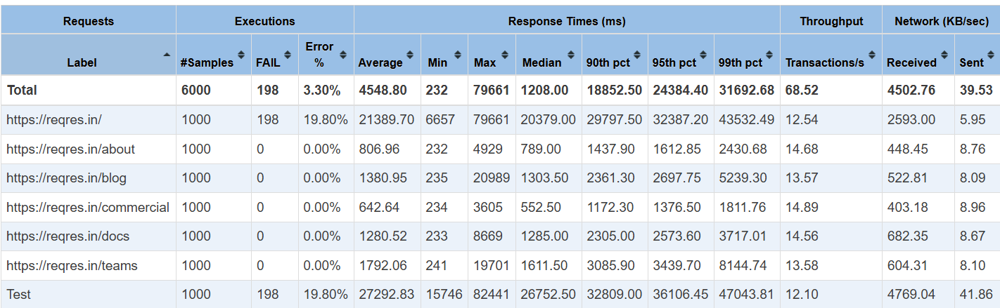
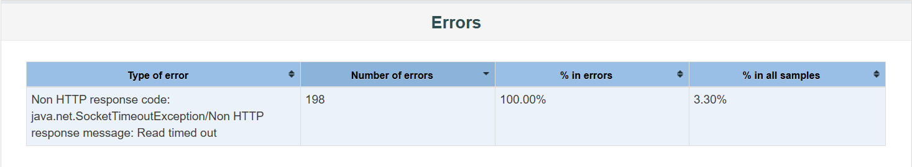
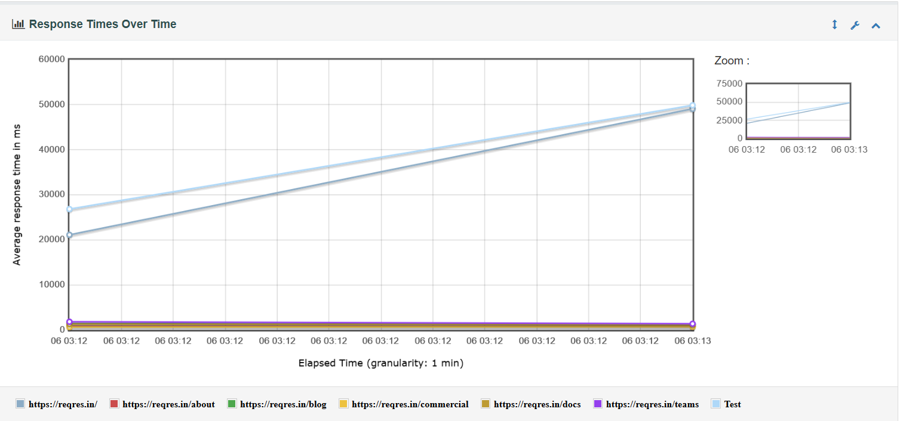

# JMeter Load & Stress Testing — ReqRes API

Performance and load testing analysis of the **ReqRes** web application using Apache JMeter. This project evaluates system behavior, throughput, and error rates under progressively higher concurrency levels—scaling from baseline load up to heavy stress conditions.

---

## Test Objectives & Scenarios
The primary objective was to observe performance degradation, latency patterns, and failure thresholds as concurrent virtual users increased. The test script executes a multi-endpoint workflow via HTTP GET requests:
* `GET /`
* `GET /teams`
* `GET /blog`
* `GET /docs`
* `GET /about`
* `GET /commercial`

### Concurrency Tier Matrix
| Test Tier | Virtual Users (Threads) | Test Purpose |
| :--- | :--- | :--- |
| **Test 1** | 250 | Baseline Load |
| **Test 2** | 350 | Moderate Load Increase |
| **Test 3** | 500 | High Load (Initial Error Threshold) |
| **Test 4** | 750 | Stress Test (Heavy Load & Degradation) |
| **Test 5** | 1000 | Peak Stress Test (Maximum Concurrency) |

---

## Test Results & Summary

| Concurrency (Threads) | Total Requests | Avg Response Time (ms) | Min (ms) | Max (ms) | Error Count | Error Rate (%) | Throughput (req/sec) |
| :--- | :--- | :--- | :--- | :--- | :--- | :--- | :--- |
| **250** | 1,500 | 1,242 | 232 | 8,534 | 0 | 0.00% | 88.1 |
| **350** | 2,100 | 1,684 | 233 | 25,583 | 0 | 0.00% | 59.8 |
| **500** | 3,000 | 4,717 | 232 | 27,599 | 5 | 0.17% | 67.4 |
| **750** | 4,500 | 3,644 | 233 | 191,176 | 63 | 1.40% | 22.5 |
| **1000** | 6,000 | 4,548 | 232 | 79,661 | 198 | 3.30% | 68.1 |

Summary report for 1000 threads


Error Breakdown Under Stress


---

## Key Observations

1. **Response Time Degradation:** Average response times climbed significantly as virtual users scaled past 350 threads, with maximum tail latencies spiking dramatically during heavy stress tiers (750+ users).
2. **Error Manifestation:** The system remained stable with 0% error rates up to 350 users. Concurrency-related failures (such as `SocketException` and `NoHttpResponseException`) began surfacing at 500 threads and peaked at 3.30% during the 1000-user run due to connection exhaustion and resource contention.
3. **Throughput Bottlenecks:** Throughput ceased linear scaling under heavy loads, reflecting server-side processing limits and network saturation.



---

## Repository Structure

```text
reqres-load-stress-testing/
│
├── test-plans/
│   └── reqrestest.jmx
│
├── results/
│   ├── results_250.jtl
│   ├── results_350.jtl
│   ├── results_500.jtl
│   ├── results_750.jtl
│   └── results_1000.jtl
│
├── screenshots/
│   ├── 01-test-plan.png
│   ├── 02-dashboard-summary.png
│   ├── 03-response-times-over-time.png
│   └── 04-error-breakdown.png
│
└── README.md
```
## How to Reproduce
1. Clone the Repository
```
git clone https://github.com/naham6/reqres-load-stress-testing.git
cd reqres-load-stress-testing
```
2. Execute a Test via CLI
Run JMeter in non-GUI mode using the parameterized thread property (Optional if you want to see the report only):
```
jmeter -n -t test-plans/reqrestest.jmx -l results.jtl
```
3. Generate HTML Dashboard Reports Locally
To generate a complete HTML report dashboard from any result file:
```
jmeter -g results/results_500.jtl -o report
```
